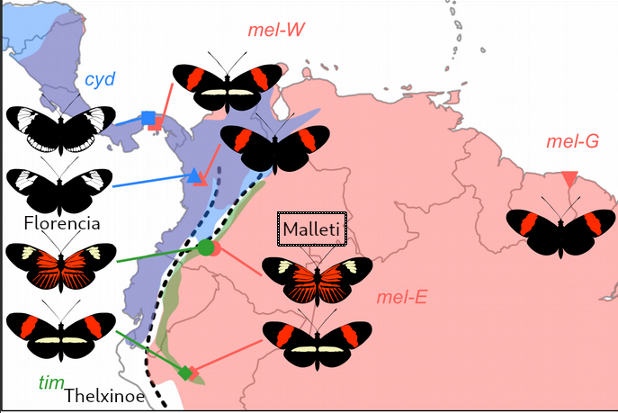

---
---

# <span class="todo TODO">TODO</span> Análisis poblacionales por sitios y ventanas

## Motivación y explicación

EL índice de fijación F<sub>ST</sub> es una medida de separación entre
grupos de individuos. En teoría F<sub>ST</sub> varía entre 0 y 1 en
donde 0 representa la ausencia de distancia genética entre poblaciones,
mientras que 1 significa que las poblaciones están totalmente separadas.

La diferenciación entre poblaciones puede variar a lo largo del genoma;
dos poblaciones pueden ser casi idénticas en una región y tener una
fuerte diferenciación en otra. Las regiones del genoma con evidencia de
divergencia fuerte son interesantes; podrían potencialmente albergar
genes que permitan a las poblaciones adaptarse a diferentes ambientes,
dependiendo de los alelos que tengan. En este caso la exploración de
estos patrones a lo largo del genoma se vuelve interesante.

El estimado que usaremos está basado en el método de [Weir y Cockerham
(1984)](https://www.jstor.org/stable/2408641). Este método esencialmente
estima las varianzas genéticas entre poblaciones (P), individuos de una
población (I) y genotipos de un individuo (G). Luego utiliza la
siguiente expresión para estimar el índice de fijación entre
poblaciones:


## Calculando índice de fijación F<sub>ST</sub> por sitio

Requerimientos computacionales: TBD

1.  **Preparando los datos**

    Para este análisis ya tenemos una gran parte preparada; nuestro
    archivo de genotipos ya fue filtrado en un paso anterior. Vamos a
    usar `vcftools` para analizar la estructura por ventana usando este
    archivo y otras piezas de información.

    Necesitamos preparar archivos de texto en los que especificamos la
    población a la que pertenece cada muestra. Usando `nano` crea un
    archivo por población. Cada archivo debe tener una columna con los
    identificadores de las muestras que pertenecen a determinada
    población tal y como aparecen en la línea `#CHROM` del archivo
    `vcf`. Para este análisis ignora a las muestras de especies
    'silvaniformes', utiliza solo las dos poblaciones de *H. timareta* y
    la población de *H. melpomene* (3 poblaciones en total). Estas
    poblaciones son más cercanas genéticamente entre sí que cualquiera
    de ellas con las silvaniformes.

2.  **Estimando la estructura a lo largo de Hmel218003o**

    Utiliza `vcftools` con las opciones `--weir-fst-pop <archivo
            identidades>`. Revisa [la documentación de
    `vcftools`](https://vcftools.github.io/man_latest.html) para
    informarte sobre cómo comparar individuos de dos poblaciones. En
    teoría puedes estimar la estructura genética entre más de dos grupos
    pero la interpretación de los resultados se vuelve compleja, por eso
    vamos a comparar **pares de poblaciones**. Recuerda especificar un
    prefijo para tu archivo de salida con la opción `--out <prefijo>`.

    <details>
    <summary> Trata de construir la línea de comando por tu cuenta. Si no puedes avanzar mira el código aquí </summary>

    ``` shell
    # comparacion timaretas: florencia thelxinoe
    vcftools --gzvcf heliconius.optixscaf.SNPS.NV.FL2.vcf.gz \
             --weir-fst-pop tim_fln_ids.txt --weir-fst-pop tim_thx_ids.txt \
             --out fln_thx_fst.SITIO

    # comparacion malleti florencia
    vcftools --gzvcf heliconius.optixscaf.SNPS.NV.FL2.vcf.gz \
             --weir-fst-pop tim_fln_ids.txt --weir-fst-pop melp_mallet_ids.txt \
             --out mallet_fln_fst.SITIO

    # comparacion malleti thelxinoe
    vcftools --gzvcf heliconius.optixscaf.SNPS.NV.FL2.vcf.gz \
             --weir-fst-pop tim_thx_ids.txt --weir-fst-pop melp_mallet_ids.txt \
             --out mallet_thx_fst.SITIO
    ```

    </details>

3.  **Examinando los resultados:**

    Examina los archivos de texto que resultaron de estimar
    F<sub>ST</sub> por sitios con `vcftools`.

    Responde a las preguntas:

    -   [ ] ¿Qué estructura tienen los archivos (número de filas y
        columnas, encabezado)?

    -   [ ] ¿Qué inforamción puedes identificar en ellos (contenido de
        cada columna)?

    -   [ ] ¿Cuántos estimados de estructura aparecen?

    -   [ ] ¿Qué valores aparecen más frecuentemente? ¿Cuál piensas que
        es la razón por la que observamos estos valores?

4.  **Visualizando F<sub>ST</sub> por sitio a lo largo de Hmel218003o**

    Antes de importar los datos a `R` vamos a procesar nuestro archivo
    para ignorar los valores no numéricos. De esta forma podemos
    procesar los datos un poco más fácil en `R`. Usa `grep` para excluir
    las posiciones con valores no numéricos y guarda el resultado en un
    nuevo archivo.

    Carga la librería `tidyverse` y los datos en `R`.

    ``` r
    ### limpia el ambiente de trabajo
    rm(list=ls())

    library(tidyverse)

    ### carga los datos
    fst_site <- read_tsv("archivo.weir.fst")

    ### recuerda cargar las tres comparaciones
    ```

    Ahora debemos agregarle una nueva columna a cada uno de los
    dataframes que indique la comparación que estamos haciendo. Puedes
    hacerlo usando la función
    [`mutate`](https://dplyr.tidyverse.org/reference/mutate.html) de
    `tidyverse`. En la nueva columna incluye el nombre de la comparación
    tantas veces como filas tenga el dataframe. Puedes hacer esto usando
    las funciones `rep` y `nrow`. `nrow(dataframe)` te debería dar el
    número de filas en el dataframe. Haz esto para los tres marcos de
    datos.

    <details>
    <summary> Trata de escribir el código por tu cuenta. Si no puedes avanzar mira el código aquí </summary>

    ``` r
    ###
    ### mutate le agrega la columna COMP al dataframe fst_site
    ### la columna que agrega es "comparacion" repetida nrow(fst_site) veces
    fst_site <- mutate(fst_site, COMP=rep("comparacion", nrow(fst_site)))
    ```

    </details>

    Junta los datos usando la función `rbind`. La función `rbind` junta
    las filas de los dataframes que entran como parámetro.

    <details>
    <summary> Si necesitas pistas de cómo hacerlo puedes ver el código aquí </summary>

    ``` r
    ### rbind une los datos de las tres comparaciones
    ### de forma vertical
    fst_todos <- rbind(fst_site1, fst_site2, fst_site3)
    ```

    </details>

    Pinta los datos uisando `ggplot`. Haz un gráfico de puntos
    (`geom_point()`) con la posición en `Hmel218003o` en el eje x y el
    índice de fijación por sitio en el eje y. En mi caso pinté las
    diferentes comparaciones usando diferentes colores. Puedes también
    pintarlas en paneles independientes usando la función `facet_wrap`.

    <details>
    <summary> Si necesitas pistas de cómo hacerlo puedes ver el código aquí </summary>

    ``` r
    ### Pintamos un grafico de puntos dandole colores diferentes a cada
    ### comparacion
    ggplot(data=fst_todos, aes(x=POS, y=WEIR_AND_COCKERHAM_FST, color=COMP)) +
      geom_point() + theme_bw() +
      labs(x="Posicion en Hmel218003o", y=expression("F"["ST"]))
    ```

    </details>

    Observemos la gráfica:

    

    Se ve terrible! :fearful: No podemos distinguir muchos detalles a lo
    largo de la región examinada.

    -   [ ] ¿Qué valores u observaciones se ven extrañas o incorrectas?

    -   [ ] ¿Qué podemos hacer para conservar solo los valores que
        tengan sentido?

    -   [ ] ¿Cómo podemos mejorar la visualización?

    

    -   [ ] ¿Podemos hacer inferencias basados en esta nueva versión?
        ¿Qué comparaciones muestran mayores índices de fijación en
        general?

## Calculando índice de fijación F<sub>ST</sub> por ventana

Requerimientos computacionales: TBD

1.  **Preparando los datos**

    En este caso los archivos de entrada son los mismos que cuando
    calculamos F<sub>ST</sub> por sitio.

2.  **Estimando la estructura a lo largo de Hmel218003o**

    Utiliza `vcftools` con las opciones
    `--weir-fst-pop <archivo identidades>`
    `--fst-window-size <tamaño ventana>`
    `--fst-window-step <tamaño paso>` para correr el análisis usando
    ventanas de un tamaño determinado por `<tamaño ventana>`, dando
    pasos que miden `<tamaño paso>` a lo largo del scaffold. Para
    empezar, usa un tamaño de ventana de 10000 bases y un tamaño de paso
    de 5000 bases. Recuerda qué información debes incluir para comparar
    dos poblaciones. Recuerda especificar un prefijo para tu archivo de
    salida con la opción `--out <prefijo>`.

    <details>
    <summary> Trata de construir la línea de comando por tu cuenta. Si no puedes avanzar mira el código aquí </summary>

    ``` shell
    # comparacion timaretas
    vcftools --gzvcf heliconius.optixscaf.SNPS.NV.FL2.vcf.gz \
             --weir-fst-pop tim_fln_ids.txt --weir-fst-pop tim_thx_ids.txt \
             --fst-window-size 10000 --fst-window-step 5000 --out fln_thx_fst

    # comparacion malleti florencia
    vcftools --gzvcf heliconius.optixscaf.SNPS.NV.FL2.vcf.gz \
             --weir-fst-pop tim_fln_ids.txt --weir-fst-pop melp_mallet_ids.txt \
             --fst-window-size 10000 --fst-window-step 5000 --out mallet_fln_fst

    # comparacion malleti thelxinoe
    vcftools --gzvcf heliconius.optixscaf.SNPS.NV.FL2.vcf.gz \
             --weir-fst-pop tim_thx_ids.txt --weir-fst-pop melp_mallet_ids.txt \
             --fst-window-size 10000 --fst-window-step 5000 --out mallet_thx_fst
    ```

    </details>

3.  **Examinando los resultados: Ventanas a lo largo de Hmel218003o**

    Examina los archivos de texto que resultaron de estimar
    F<sub>ST</sub> por ventanas con `vcftools`.

    Responde a las preguntas:

    -   [ ] ¿Qué estructura tienen los archivos (número de filas y
        columnas, encabezado)?

    -   [ ] ¿Qué inforamción puedes identificar en ellos (contenido de
        cada columna)?

    -   [ ] ¿Cuántos estimados de estructura aparecen?

    -   [ ] ¿Observas diferencias entre los dos estimados de estructura?

    Ve a [ensembl.lepbase.org](http://ensembl.lepbase.org/index.html) y
    haz click sobre *Heliconius melpomene melpomene*, Hmel2.5.

    

    En la parte superior derecha encuentras la herramienta de búsqueda.
    Esta herramienta te permite buscar en el genoma de *H. melpomene*
    por coordenada genómica o por nombre del elemento (gen). Si buscas a
    un elemento por nombre podrás encontrar detalles de su localización
    en el genoma. Busca al gen *optix* en la barra de búsqueda.

    

    -   [ ] Cuáles son las coordenadas del gen *optix* en el scaffold
        `Hmel218003o`?

4.  **Visualizando F<sub>ST</sub> a lo largo de Hmel218003o**

    Graficar los resultados por ventana es muy similar a como lo hicimos
    por sitio. Carga la librería `tidyverse` y los datos en `R`.

    ``` r
    ### limpia el ambiente de trabajo
    rm(list=ls())

    library(tidyverse)

    ### carga los datos
    fst_site <- read_tsv("archivo.weir.ventanas.fst")

    ### recuerda cargar las tres comparaciones
    ```

    Ahora debemos agregarle una nueva columna a cada uno de los
    dataframes que indique la comparación que estamos haciendo. Puedes
    hacerlo usando la función
    [`mutate`](https://dplyr.tidyverse.org/reference/mutate.html) de
    `tidyverse`. En la nueva columna incluye el nombre de la comparación
    tantas veces como filas tenga el dataframe. Puedes hacer esto usando
    las funciones `rep` y `nrow`. `nrow(dataframe)` te debería dar el
    número de filas en el dataframe. Haz esto para los tres marcos de
    datos.

    <details>
    <summary> Trata de escribir el código por tu cuenta. Si no puedes avanzar mira el código aquí </summary>

    ``` r
    ###
    ### mutate le agrega la columna COMP al dataframe fst_site
    ### la columna que agrega es "comparacion" repetida nrow(fst_site) veces
    fst_site <- mutate(fst_site, COMP=rep("comparacion", nrow(fst_site)))
    ```

    </details>

    Junta los datos usando la función `rbind`. La función `rbind` junta
    las filas de los dataframes que entran como parámetro.

    <details>
    <summary> Si necesitas pistas de cómo hacerlo puedes ver el código aquí </summary>

    ``` r
    ### rbind une los datos de las tres comparaciones
    ### de forma vertical
    fst_todos <- rbind(fst_site1, fst_site2, fst_site3)
    ```

    </details>

    Pinta los datos uisando `ggplot`. Haz un gráfico de línea
    (`geom_line()`) o de punto (`geom_point()`).Usa la posición de
    inicio o fin de ventana en el eje x y el índice de fijación por
    sitio en el eje y. En mi caso pinté las diferentes comparaciones
    usando diferentes colores. Puedes también pintarlas en paneles
    independientes usando la función `facet_wrap`.

    <details>
    <summary> Si necesitas pistas de cómo hacerlo puedes ver el código aquí </summary>

    ``` r
    ### Pintamos un grafico de puntos dandole colores diferentes a cada
    ### comparacion
    ggplot(data=fst_todos, aes(x=POS, y=WEIR_AND_COCKERHAM_FST, color=COMP)) +
      geom_point() + theme_bw() +
      labs(x="Posicion en Hmel218003o", y=expression("F"["ST"]))
    ```

    </details>

    Observemos la gráfica:

    

    Responde a las preguntas:

    -   [ ] ¿Qué poblaciones tienen un menor nivel de estructuración
        entre sí?

    -   [ ] ¿Qué poblaciones tienen un mayor nivel de estructuración
        entre sí?

    -   [ ] ¿Qué explicación puede tener esta diferencia entre
        comparaciones?

    -   [ ] ¿Hay alguna región de `Hmel218003o` en donde observes
        patrones interesantes?

    -   [ ] ¿Puedes pintar la posición de *optix* en tu gráfica? Pista:
        Usa la función `geom_rect` de `ggplot`.

    <details>
    <summary> Mira una versión mejorada aquí ¿Qué cambios harías en el análisis para lograr una versión así? </summary>

    

    </details>

## <span class="todo TODO">TODO</span> Otros estadísticos poblacionales

## <span class="todo TODO">TODO</span> Estadísticos de selección

# <span class="todo TODO">TODO</span> Introgresión

## Motivación

Recientemente en biología evolutiva la idea de que las poblaciones y las
especies pueden entrar en contacto e intercambiar material genético ha
sido más aceptada. La disponibilidad de técnicas de secuenciación y
herramientas estadísticas ha tenido como consecuencia la publicación de
evidencia que soporta este cambio de paradigma.

Una de las herramientas estadísticas que primero se usó para detectar
introgresión entre especies se conoce como D de Patterson [(Green et
al., 2010)](https://www.science.org/doi/abs/10.1126/science.1188021).
Este estadístico ha sido ampliamente utilizado para describir eventos de
introgresión en varios taxa. El D de Patterson y los estadísticos
derivados de este se calculan de forma simple, se ajustan bien a los
datos genómicos y funcionan bien en muchos escenarios demográficos.

La evolución de diversos rasgos adaptativos en varias especies puede
ocurrir por introgresión. En nuestro caso la hipótesis es que hubo flujo
genético entre *H. melpomene malleti* y *H. timareta florencia* y que
este flujo genético le permitió a *H. timareta florencia* convergir
fenotípicamente, creando un anillo mimético con *H. melpomene malleti*.
Recuerda el valor adaptativo del mimetismo Mülleriano para *Heliconius*.

|                                                                                                                      |
|-----------------------------------------------------------------------------------------------------------------------------------------------------------------|
| Razas que tenemos para nuestra hipótesis de introgresión ([Martin et al., 2019](https://journals.plos.org/plosbiology/article?id=10.1371/journal.pbio.2006288)) |

Aprenderemos a utilizar uno de muchos programas disponibles para
calcular D de Patterson, explorar si hay evidencia de introgresión en
nuestros datos y pensar en la relevancia biológica de nuestras
observaciones.

## D de Patterson: Explicación

|                                                                                                                |
|----------------------------------------------------------------------------------------------------------------------------------------------------------|
| Patrones ABBA y BABA que pueden surgir si el alelo derivado (B) va a P2 o a P1 ([Dasmahpatra et al., 2012](https://www.nature.com/articles/nature11041)) |

Denotamos los alelos que están en el outgroup como A y los alelos
derivados como B. Para el conjunto ordenado {P<sub>1</sub>,
P<sub>2</sub>, P<sub>3</sub>, O} tenemos dos configuraciones alélicas de
interés: ABBA ó BABA. ABBA se refiere a los sitios en donde
P<sub>1</sub> tiene el alelo del outgroup y P<sub>2</sub> y
P<sub>3</sub> compartan el alelo derivado. BABA corresponde a sitios en
donde P<sub>1</sub> y P<sub>3</sub> compartan el alelo derivado y
P<sub>2</sub> tiene el alelo del outgroup. El estadístico D se define
como


Donde C<sub>ABBA</sub>(i) y C<sub>BABA</sub>(i) son 0 ó 1 si uno de los
dos patrones se observa en el sitio *i* a lo largo de *n* sitios. El
numerador cuantifica el exceso de uno de los dos patrones respecto al
otro y el numerador normaliza por el número total de patrones
observados.

Esta explicación es una simplificación; si contáramos solo los sitios en
los cuales todos los individuos de P<sub>1</sub> y del outgroup tienen
el alelo A y todos los individuos de P<sub>2</sub> y P<sub>3</sub>
tienen el alelo B para cuantificar patrones ABBA estamos ignorando
muchos sitios con información útil. La forma de calcular el estadístico
D en la práctica involucra el uso de frecuencias alélicas.

Si p<sub>ij</sub> denota la frecuencia del alelo i en la población j (i
= {1, 2}; j = {1, 2, 3, 4}) entonces el D de Patterson se estima como


## <span class="todo TODO">TODO</span> Referencias importantes

# <span class="todo TODO">TODO</span> Introgresión: Estimados por ventana

## <span class="todo TODO">TODO</span> Evolución de la adaptación

Vamos

## Análisis por ventanas

Recursos computacionales: TBD

1.  **Preparando los datos:**

    Vamos a trabajar con nuestro `vcf` filtrado al igual que cuando
    calculamos el índice de fijación por ventanas. En este caso también
    debemos especificar la población a la que pertenecen nuestras
    muestras de la siguiente manera. Crea un archivo nuevo usando
    `nano`, dale un nombre informativo. Al interior de este archivo
    debes esribir dos columnas separadas por tabulación (`\t`). En la
    primera columna debes tener los nombres de las muestras tal y como
    aparecen en el `vcf`. En la segunda columna debes especificar la
    población a la que pertenece cada muestra. Debemos especificar las
    poblaciones P1, P2 y P3 del análisis de introgresión. Los nombres de
    las poblaciones son: Florencia, Thelxinoe, Malleti y Silvaniformes,
    pero las Silvaniformes son nuestro outgroup, luego para ellas
    debemos especificar la palabra Outgroup en la columna derecha. En
    teoría todas las muestras del Outgroup deberían funcionar bien, pero
    si el Outgroup y P1 experimentaron flujo genético en la región de
    interés esto puede crear artefactos en los resultados. Es posible
    que nuestras muestras de *H. pardalinus*, que son de Perú, muestren
    evidencia de flujo con otras *Heliconius* de Perú (como Thelxinoe).
    Es por eso que a estas las excluimos del análisis marcando la
    segunda columna como xxx.

    El archivo de poblaciones debe verse parecido a esto:

    ``` shell
    muestra1.1 Poblacion1
    muestra1.2 Poblacion1
    muestra2.1 Poblacion2
    muestra2.2 Poblacion2
    muestra3.1 Poblacion3
    muestra3.2 Poblacion3
    muestraO.1 Outgroup
    muestraO.2 xxx
    muestraO.3 Outgroup
    ```

2.  **Estimando las estadísticas D:**

    Dsuite está disponible en para los usuarios de `biologia.evolutiva`
    en `/shared/Dsuite/Build/Dsuite`

    Prueba varios tamaños de ventana y paso: Prueba las combinaciones
    20,10; 50,25; 100,50; 500,250; 1000,500. Cada una de ellas no tarda
    mucho en correr. **Reto:** Puedes hacerlo en un ciclo `for`? Pista:
    Puedes hacerlo con operaciones aritméticas, las cuales deben ir
    dentro de dobles paréntesis y precedidas por el operador `$`.

    Ejemplo:

    ``` shell
    num=30
    # multiplica a num por 2
    resultado=$(($num*2))
    # resultado es 60
    ```

3.  **Examinando los datos:**

    Examina los archivos que resultaron de correr `Dinvestigate` con
    varios tamaños de ventana y responde a las preguntas.

    -   [ ] ¿Qué estructura tienen los archivos (número de filas, número
        de columnas y encabezado)?

    -   [ ] ¿Qué información puedes identificar en los archvios
        (contenido de las columnas)?

    -   [ ] ¿Cuántos estimados de flujo genético aparecen?

    Ve a [ensembl.lepbase.org](http://ensembl.lepbase.org/index.html) y
    haz click sobre *Heliconius melpomene melpomene*, Hmel2.5.

    

    En la parte superior derecha encuentras la herramienta de búsqueda.
    Esta herramienta te permite buscar en el genoma de *H. melpomene*
    por coordenada genómica o por nombre del elemento (gen). Si buscas a
    un elemento por nombre podrás encontrar detalles de su localización
    en el genoma. Busca al gen *optix* en la barra de búsqueda.

    

    -   [ ] ¿Cuáles son las coordenadas del gen *optix* en el scaffold
        `Hmel218003o`?

4.  **Visualizando los resultados:**

    Crea una gráfica del estadístico D a lo largo del scaffold
    `Hmel218003o`. Puedes usar un gráfico de línea o punto. Tu resultado
    debe verse como esta gŕafica. Pinta los estimados que obtuviste con
    varios tamaños de ventana y decide cuál es más informativo.

    

    -   [ ] ¿Hay alguna región de `Hmel218003o` en donde observes
        patrones interesantes?

    -   [ ] ¿Puedes pintar la posición del gen *optix* en tu gráfica?
        Pista: Usa la función `geom_rect` de `ggplot`.
